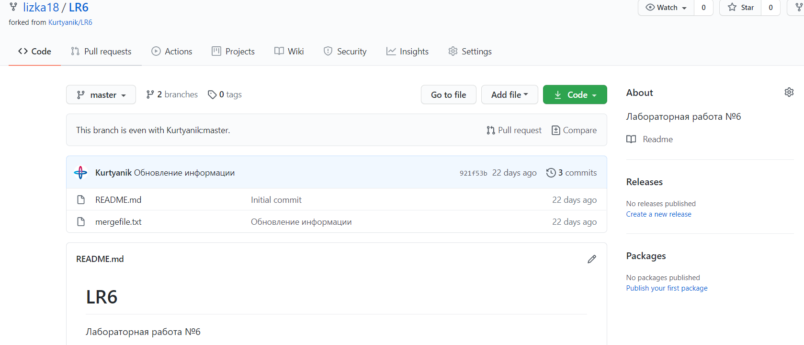
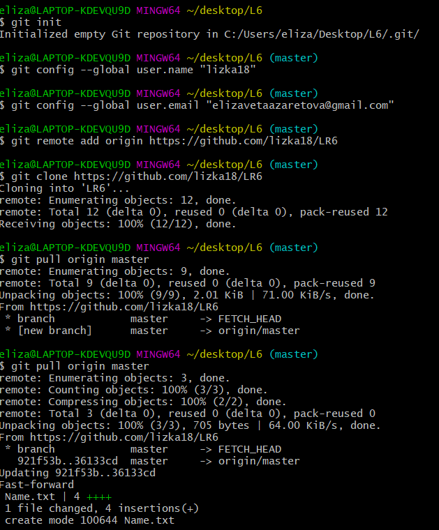

# LR6
**Елизавета Азаретова 4916 Лабораторная работа№6**
_Цель работы:изучение базовых возможностей системы

_управления версиями, опыт работы с Git Api, опыт работы с локальным и

_удаленным репозиторием.

Ход работы:

На сайте GitHub сделала копию https://github.com/Kurtyanik/LR6/

С помощью команды _cd desktop/L6_ в консоли Git Bash перешёла в созданную папку L6

Использовал команду _git init_ чтобы инициализировать гит в данной папке

Командой _git cjnfing —global user.name/email_ внесла свои данные.

Командой _git remote add origin_ связала папку с удалённым репозиторием на сайте GitHub

Затем через графический интерфейс GitHub добавил новый файл _Name.txt_ в удалённый репозиторий в ветку __master__

Пользуясь командой _git pull origin master_ загрузил изменения из удалённого репозитория в локальный

Командой _git log_ получил список операций/коммитов

И используя _git show_ получил более подробную информацию по последнему изменению

При попытке выполнить выполнить слияние веток **master** и **branch1** командой _git merge branch1_ и получила конфликт в файле mergefile.txt

Вручную изменила его,  и выполнила слияние веток **master** и **branch1**
Затем удалила ветку **branch1** командой _git branch -d_ и запушила всё в удалённый репозиторий 

Затем сделала несколько изменений, добавив новые файлы

Командой _git reset —hard HEAD~1_ выполнила откат последнего коммита - добавления файла **Удалить**

Пользуясь командой _git checkout -b otchet_LR6_ создала новую ветку **otchet_LR6**

Текущая история _git log —graph_ . Аргумент —graph позволяет графически изобразить ветки и коммиты на них

С помощью команды _git add ._ подготовила все новые файлы в папке **L6** к пушу

Запушила файлы скриншотов в удалённый репозиторий

Оформляю отчёт в файле **README.md**

Все файлы скриншотов лежат в папке **скриншоты**

Вывод:изучили базовые возможности системы
управления версиями, получили опыт работы с Git Api и опыт работы с локальным и
удаленным репозиторием.
